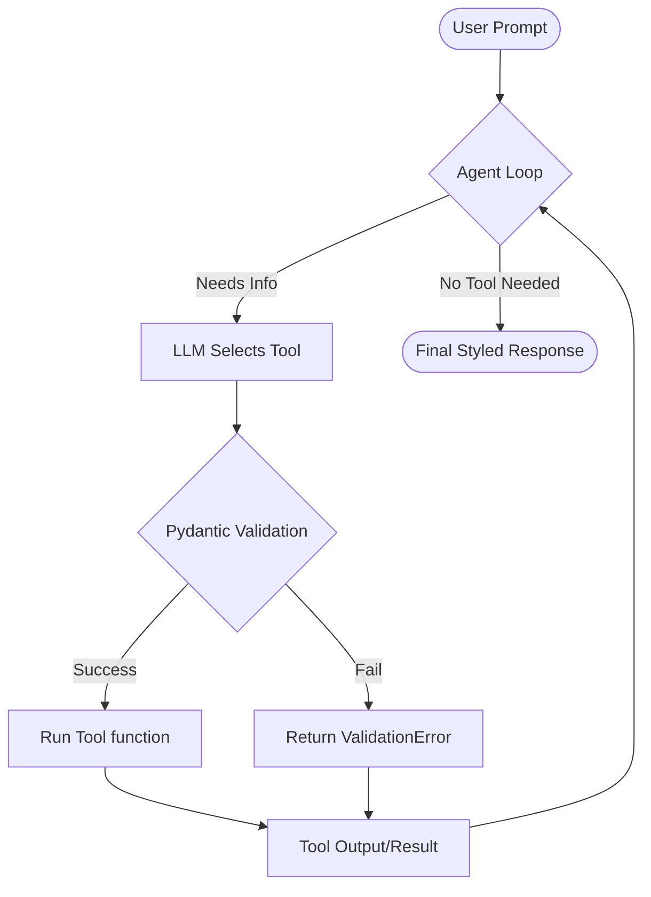

# 🔍 Research Assistant Agent

An AI-powered conversational agent designed to streamline your research workflows. Built using **LangChain**, **Groq (Llama 3.3 70B)**, and **Pydantic**, this assistant can search academic papers on arXiv, summarize online PDFs with academic precision, and retrieve recent emails from any IMAP-compatible mail server.

---

## 🌟 Key Features

### User Interface

# 🎨 Research Assistant with Llama-3.3 & Groq

A professional, AI-powered research assistant built with **LangChain**, **Groq**, **Llama-3.3 70B**, and **Pydantic**.
This assistant can:

- 🔍 Search arXiv for papers
- 📄 Summarize PDFs
- 📨 Read emails (using Gmail IMAP)

---

## 🎯 Key Features

*   **Smart Academic Search**: Queries arXiv for research papers on any topic and returns structured results (titles, authors, summaries, and PDF links) with robust input validation.
*   **PDF Analyzer & Summarizer**: Downloads online PDFs and leverages Llama-3.3 to summarize key methodologies, requirements, insights, and conclusions in an academic tone.
*   **IMAP Email Reader**: Securely fetches recent email headers (sender, time, and subject) over a user-defined day window.
*   **ReAct-style Agent Loop**: Dynamically selects, executes, and integrates tool execution outputs into the conversation history (supporting up to 10 conversational/execution steps per query).
*   **Strict Input Validation**: Utilizes Pydantic models (`ArxivInput`, `PDFInput`, `EmailInput`) to enforce data hygiene and format compliance for all tool invocations before execution.

---

## ⚙️ Architecture Workflow

The agent uses a ReAct (Reasoning and Acting) execution pattern to process queries:



---

## 🛠️ Prerequisites

Ensure you have the following installed/configured:

*   **Python 3.9+**
*   **Groq API Key**: Obtain a key from the [Groq Console](https://console.groq.com/).
*   **Email App Password**: If using Gmail or similar secure email services, generate an App Password to allow IMAP connections (traditional account passwords will be rejected).

---

## 🚀 Installation & Setup

1.  **Clone or Download** the project files to your working directory.
2.  **Install the Required Dependencies**:
    ```bash
    pip install langchain langchain_core langchain-groq arxiv pypdf pydantic python-dotenv requests
    ```
3.  **Configure Environment Variables**:
    Create a `.env` file in the root of the project directory and add your Groq API key:
    ```env
    #required
    groq=your_groq_api_key_here

    #optional (only if using email tool and don't want to feed email and app pass again and again)
    email=your_email@gmail.com
    app_pass=your_app_password_16_chars
    ```

---

## 💻 Usage

To start the interactive CLI research assistant, run the script:

```bash
python research_assistant.py
```

### Example Prompts to Try

*   **arXiv Search**:
    > *"Find 3 recent papers on transformers."*
    
*   **PDF Summarizer**:
    > *"Can you summarize this paper for me: https://arxiv.org/pdf/2009.11850.pdf"*
*   **Email Retrieval**:
    > *"Check my inbox for emails received in the last 2 days. My email is [EMAIL_ADDRESS] and app pass is abcdefghijklmnop"*

Type `exit`, `quit`, or `bye` to terminate the session.

---

## 📊 Example Execution & Outputs

Here are real execution outputs from the assistant showing tool invocations, inputs, and final responses:

### 1. arXiv Academic Search
**User Prompt:**
> *Help me get 2 research papers on topic "transformers"*

**Agent Output:**
```text
[Agent] : * **Title:** Attention Is All You Need
**Authors:** Ashish Vaswani, Noam Shazeer, Niki Parmar, Jakob Uszkoreit, Llion Jones, Aidan N. Gomez, Łukasz Kaiser, Illia Polosukhin
**Summary:** This paper introduces the Transformer model, which relies entirely on self-attention mechanisms to process sequences in parallel. The model achieves state-of-the-art results in machine translation tasks. The Transformer model is based on encoder-decoder architecture and uses multi-head attention mechanisms to attend to different parts of the input sequence.
**PDF Link:** https://arxiv.org/pdf/1706.03762.pdf
* **Title:** BERT: Pre-training of Deep Bidirectional Transformers for Language Understanding
**Authors:** Jacob Devlin, Ming-Wei Chang, Kenton Lee, Kristina Toutanova
**Summary:** This paper introduces BERT (Bidirectional Encoder Representations from Transformers), a pre-trained language model that achieves state-of-the-art results in a wide range of natural language processing tasks. BERT is based on the Transformer model and uses a multi-layer bidirectional transformer encoder to generate contextualized representations of words in a sentence.
**PDF Link:** https://arxiv.org/pdf/1810.04805.pdf
```

### 2. PDF Analyzer & Summarizer
**User Prompt:**
> *summarise the pdf https://arxiv.org/pdf/1706.03762.pdf*

**Agent Execution Logs & Output:**
```text
[TOOL]: summarize_pdf
[ARGS]: {'pdf_path': 'https://arxiv.org/pdf/1706.03762.pdf'}
[TOOL OUTPUT]: **Attention Is All You Need**,
**Ashish Vaswani, Noam Shazeer, Niki Parmar, Jakob Uszkoreit, Llion Jones, Aidan N. Gomez, Łukasz Kaiser, and Illia Polosukhin**,
**Summary**: The paper introduces the Transformer, a novel neural network architecture that relies entirely on attention mechanisms to model complex dependencies in input and output sequences. The Transformer outperforms existing state-of-the-art models in machine translation tasks, achieving a new single-model state-of-the-art BLEU score of 28.4 on the WMT 2014 English-to-German translation task and 41.8 on the WMT 2014 English-to-French translation task. The model also generalizes well to other tasks, such as English constituency parsing, and achieves competitive results.
**Requirements**: The Transformer model requires a significant amount of computational resources, including 8 NVIDIA P100 GPUs, and a large dataset for training, such as the WMT 2014 English-German dataset. The model also requires careful tuning of hyperparameters, including the number of attention heads, the dimensionality of the attention keys and values, and the dropout rate.
**Insights**: The paper provides several insights into the Transformer architecture, including the importance of self-attention mechanisms, the use of multi-head attention to jointly attend to information from different representation subspaces, and the use of positional encoding to preserve the order of the input sequence. The paper also highlights the benefits of the Transformer architecture, including its ability to parallelize computation, its flexibility, and its interpretability.
**Conclusion**: The Transformer is a novel and effective neural network architecture that relies entirely on attention mechanisms to model complex dependencies in input and output sequences. The model achieves state-of-the-art results in machine translation tasks and generalizes well to other tasks, making it a promising approach for a wide range of natural language processing applications.

[Agent] : **Attention Is All You Need**,
**Ashish Vaswani, Noam Shazeer, Niki Parmar, Jakob Uszkoreit, Llion Jones, Aidan N. Gomez, Łukasz Kaiser, and Illia Polosukhin**,
**Summary**: The paper introduces the Transformer, a novel neural network architecture that relies entirely on attention mechanisms to model complex dependencies in input and output sequences. The Transformer outperforms existing state-of-the-art models in machine translation tasks, achieving a new single-model state-of-the-art BLEU score of 28.4 on the WMT 2014 English-to-German translation task and 41.8 on the WMT 2014 English-to-French translation task. The model also generalizes well to other tasks, such as English constituency parsing, and achieves competitive results.
**Requirements**: The Transformer model requires a significant amount of computational resources, including 8 NVIDIA P100 GPUs, and a large dataset for training, such as the WMT 2014 English-German dataset. The model also requires careful tuning of hyperparameters, including the number of attention heads, the dimensionality of the attention keys and values, and the dropout rate.
**Insights**: The paper provides several insights into the Transformer architecture, including the importance of self-attention mechanisms, the use of multi-head attention to jointly attend to information from different representation subspaces, and the use of positional encoding to preserve the order of the input sequence. The paper also highlights the benefits of the Transformer architecture, including its ability to parallelize computation, its flexibility, and its interpretability.
**Conclusion**: The Transformer is a novel and effective neural network architecture that relies entirely on attention mechanisms to model complex dependencies in input and output sequences. The model achieves state-of-the-art results in machine translation tasks and generalizes well to other tasks, making it a promising approach for a wide range of natural language processing applications.
```

### 3. Secure IMAP Email Reader
**User Prompt:**
> *fetch me past three days mails from my inbox with account "******mail@gmail.com" with password "tk*******kc"*

**Agent Execution Logs & Output:**
```text
[TOOL]: process_last_x_emails
[ARGS]: {'app_pass': 'tk*******kc', 'days': 3, 'email': '******mail@gmail.com'}
[TOOL OUTPUT]: Message 1
Time: 2026-06-05 21:08:38
Sender: google <google-noreply@google.com>
Subject: New privacy settings for Search services

Message 2
Time: 2026-06-07 05:55:31
Sender: Patreon <no-reply@mailgun.patreon.com>
Subject: Updates to Patreon's Terms and Privacy Policy

Message 3
Time: 2026-06-07 16:51:20
Sender: Google <no-reply@accounts.google.com>
Subject: Security alert

Message 4
Time: 2026-06-07 22:20:10
Sender: Adobe for Photographers <mail@mail.adobe.com>
Subject: Try new Film-Inspired Presets in Lightroom

[Agent] : ### Message Number
#### 1
Time: 2026-06-05 21:08:38
#### Sender: Google
#### Subject: New privacy settings for Search services

#### 2
Time: 2026-06-07 05:55:31
#### Sender: Patreon
#### Subject: Updates to Patreon's Terms and Privacy Policy

#### 3
Time: 2026-06-07 16:51:20
#### Sender: Google
#### Subject: Security alert

#### 4
Time: 2026-06-07 22:20:10
#### Sender: Adobe for Photographers
#### Subject: Try new Film-Inspired Presets in Lightroom
```

---

## 📁 Code Structure Overview

*   **Input Validation Schemas** (`ArxivInput`, `PDFInput`, `EmailInput`): Pydantic classes that validate constraints (e.g., results count limit, app password length, email format).
*   **Core Tools**:
    *   `search_arxiv`: Uses the `arxiv` Python API wrapper.
    *   `summarize_pdf`: Extracts text using `pypdf` and uses `llm` to summarize.
    *   `process_last_x_emails`: Communicates with IMAP server using Python's native `imaplib`.
*   **Tool Registry**: A custom `Tool` wrapper encapsulates function metadata, converts schemas into Groq-compatible JSON format, and handles runtime validation errors.
*   **ResearchAgent**: The core orchestrator that maintains message state and coordinates tool-calling iterations with the Groq Llama model.
